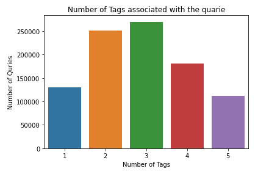
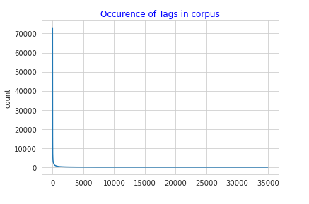
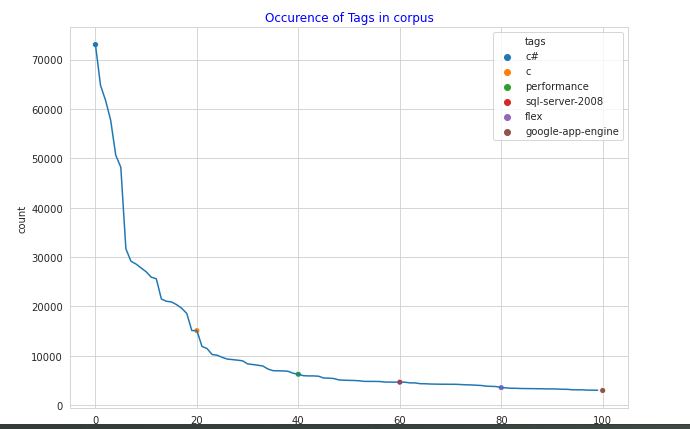

StackOverflow Tag predection is an facebook's hiring challenge in Kaggle 7 years ago.For more information check [this](https://www.kaggle.com/c/facebook-recruiting-iii-keyword-extraction/).They want us to develop a system which can assign tags to a questions in stackoverflow site automatically.

<h2> Introduction </h2>
The Question and answer site like stackoverflow allows users to assign tags manually for their questions in order to make them easier to find.There are some problems in assigning manually that is some users may unable to find a suitable tags for their questions. And other main problem is choice of choosing tags is infinite.To Overcome this kind of problem we need to develop a system which will assign the tags automatically.

	

 
 **Contents in this Blog**
 - Problem statement
 - Data overview
 - Exploratory Data Analysis
 - Data Preprocessing
 - Feature Engineering
 - Featurization
 - Converting tags for Multilabel problem 
 - Building the Model
 - Results and Observations
 
 <h3>Problem Statemet</h3>
 The task is to predict the tags (a.k.a. keywords, topics, summaries), given only the question text and its title. The dataset contains content from disparate stack exchange sites, containing a mix of both technical and non-technical questions.Read full statemnt on [kaggle](https://www.kaggle.com/c/facebook-recruiting-iii-keyword-extraction/)
 
 <h3>Data Overview</h3>
 All of the data is in 2 files train.csv and test.csv
 
 **train.csv**
 
 		 Number of Rows : 6034195
		 Number of Columns : 4
		 Size of train set : 6.7GB
		 Duplicates: yes
		 NUll values : Yes
		 Columns:
		 	 Id - A unique Identifier for each post or question
			 Title - title for a question (it was plain text)
			 Body - Body of a question (It contains html tags, code segemnts , some descrtiption)
 			 Tags - tags are seperated with space
			 
let get an instance of a dataset . I mean datapoint

**Title**:
	``` MVC4 StyleBundle not resolving images ```
	
**Body**:
	<p>My question is similar to this:</p>

	<blockquote>
	  <p><a href="http://stackoverflow.com/questions/9780099/asp-net-mvc-4-minification-background-images">ASP.NET MVC 4 Minification &amp; Background 	Images</a></p>
	</blockquote>

	<p>Except that I want to stick with MVC's own bundling if I can. I'm having a brain crash trying to figure out what the correct pattern is for specifying style bundles such that standalone css and image sets such as jQuery UI work.</p>

	<p>I have a typical MVC site structure with <code>/Content/css/</code> which contains my base CSS such as <code>styles.css</code>. Within that css folder I also have subfolders such as <code>/jquery-ui</code> which contains its CSS file plus an <code>/images</code> folder. Image paths in the jQuery UI CSS are relative to that folder and I don't want to mess with them.</p>

	<p>As I understand it, when I specify a <code>StyleBundle</code> I need to specify a virtual path which does not also match a real content path, because (assuming I'm ignoring routes to Content) IIS would then try to resolve that path as a physical file. So I'm specifying:</p>

	<pre><code>bundles.Add( 
    new StyleBundle("~/Content/styles/jquery-ui")
        .Include("~/Content/css/jquery-ui/*.css"));
	</code></pre>

	<p>rendered using:</p>

	<p><code>@Styles.Render("~/Content/styles/jquery-ui")</code></p>

	<p>I can see the request going out to:</p>

	<p><code>http://localhost/MySite/Content/styles/jquery-ui?v=nL_6HPFtzoqrts9nwrtjq0VQFYnhMjY5EopXsK8cxmg1</code></p>

	<p>This is returning the correct minified CSS response. 
But then the browser sends a request for a relatively linked image as:</p>

	<p><code>http://localhost/MySite/Content/styles/images/ui-bg_highlight-soft_100_eeeeee_1x100.png</code></p>

	<p>Which is a <code>404</code>.</p>

	<p>I understand that the last part of my URL <code>jquery-ui</code> is an extensionless URL, a handler for my bundle, so I can see why the relative request for the image is simply <code>/styles/images/</code>. </p>

	<p>So my question is <strong>what is the correct way</strong> of handling this situation? </p>

**Tags** : 
	css jquery-ui asp.net-mvc-4 bundle asp.net-optimization
	
Here in this example data point body contains code sniffet but for some datapoints it may or may not contains code . we observed that body contains html tags, some text description, code sniffet.


<h3> Exploratory Data Analysis </h3>
Exploratory is an important task to get insights about data. we will find some patterns in the data also.
For analysis we need data . we can get the data from [here](https://www.kaggle.com/c/facebook-recruiting-iii-keyword-extraction/data).just download it to your local disk or you can also directly use in kaggle kernels. For more informations about [kaggle notebook](https://www.kaggle.com/kernels).

I am loading a csv file using pandas.here i am using kaggle kernels.
```python
train_data=pd.read_csv("/kaggle/input/facebook-recruiting-iii-keyword-extraction/Train.zip",nrows=1000000)
```
Note : For smooth running i am loading first 1 million rows of dataset.If you want to process entire dataset you should need high configuration system.

**Check and remove the Duplicates data points***
In this dataset we have many data points . The reason i am removing the duplicate points is training on same datapoints multiple times model doesn't improve accuracy instead i will increase the training time . so it better to remove the duplicates.
```python
# number of duplicate values in the dataset is :
print("The Number of Duplicate values in the Dataset are :",train_data.duplicated().sum())

# Droping the Duplicates in the dataset
train_data.drop_duplicates(inplace=True)
print("The Number of Remains after Droping the Duplicated values from the  Dataset  :",train_data.shape)
```
**output :***

The Number of Duplicate values in the Dataset are : 56418
The Number of Remains after Droping the Duplicated values from the Dataset : (943582, 3)

**Checking and Remove the rows which contains Null values**
If we have null values we can use some imputation techinques ,this very feasible for when we have numerical data and the categorical data. But here in this case we have text data . Some times if have very less rows which contains null values i, then it better to drop the rows.

```python
# Checking the Missing Values in the Dataset
print(train_data.isnull().sum())
# Here only contains single Null values so it better to remove that row instead repacing the null values.
train_data.dropna(inplace=True)

```
```
output:
		Title    0
		Body     0
		Tags     1
		dtype: int64
```
		
There was only one Null value in a Tags columns. i.e There is a points doesn’t contain any tag.So we will remove that entire row.

**Analysis of Tags**
There are thousands of Unique Tags in the Dataset . But here we are considering only 1-million data points . So the unique tags are roughly 35000.
Let see how many tags are associated with each question.
```
#Counting the Tags for each Question or Row in the Dataset
train_data["Count_tags"]=train_data.Tags.apply(lambda x:len(str(x).split())) # counting for each Query
# Distibution of Tags 
sbn.countplot(train_data.Count_tags)
plt.title("Number of Tags associated with the quarie")
plt.xlabel("Number of Tags")
plt.ylabel("Number of Quries")
```

Here we Observed that :
- Atleast one tag will associate with the qestion
- Maximum tags are asociated with the question is : 5
- maximum Number of Question are associated with 3 tags.

Lets see how the distribtuion of tags in corpus by using thhe frequncy plots
plotting all 35000 tags and check how frequently appering in corpus.


plot top 1000 frequent tags 


Observations :
	- There are large number of tags which are rearly occurs . that means some kind of questions will be asked by users rearly.
	- There are very few tags occurs very frequently


Let Some of the Examples are :
- The Top 10 very frequently occured Tags are 
```
['c#' 'java' 'php' 'javascript' 'android' 'jquery' 'c++' 'python' 'iphone'
 'asp.net']
 ```
 - The top 10 very rearly occur tags are 
 ```
 ['error-console' 'math-table' 'telepathy' 'error-list'error-messages-for' 'math-input-panel' 'restitution' 'materials’  'errorformat']
 ```
 
The Words Cloud for the Tags 
 
Here C#, php,java, android, C++ occuring very frequently.
 
<h3>Data Preprocessing</h3>
Data preprocessing is very important task in a datascience pipeline. In the body columns contains html tags, punctuations, Code segments ,some text descriptions.
Here For cleaning i am using Regular expresssion.

Steps of Cleaning:
- Remove code sniffit (Not compulosary but i am assuming code segment can change from question to question . i.e i think it varies much. so get rid of this stuff ).
- Remove html tags 
- Remove Punctuations
- Convert the text to lowar case
- remove stopwords

code :
```python
def Preprocesser(doc):
    body=[]
    for text in doc:
        text=re.sub(r"href.*","",text)          #removing the href ie. removing the hyper links
        text=re.sub('<code>(.*?)</code>', '', text, flags=re.MULTILINE|re.DOTALL) # removing the code segments
        text=re.sub('<.*?>', ' ', str(text.encode('utf-8')))           #removing the Html Tags in the Text
        text=re.sub(r"[^a-zA-Z]+"," ",text)  ## removing numbers and most of Puncutuations in the Text.
        text=text.lower()                    ## converting from upper case to lower case
        body.append(" ".join([k for k in text.split() if((len(k)>2 or k=="c") and k not in li )]))
        
    return body
```

The above Preprocessed need to run for only Body column.
For title column you need convert to lower and remove stopwords because it doesn't have html tags , code segments.

Now for simplification we will concatenate both Title Column and Body Column in to a single column let say "title_body_preprocessed" column.

<h3>Feature Engineering</h3>
Feature Engineering is an state of art. Defining some features based on domine knowledge or using some hacks,some time it will increases accuracy much.So Here i am defining some meta feaures before preprocessing and After preprocessing.

Meta Features before Preprocessing :
- Number of Characters in Title Column
- Number of Characters inn Body column
- Number of Code Segents in Bidy column
- Number of Words in Title.

Meta Features After Preprocessing :
- Number of Words in Body 
- Number of Words in Title

Now stack these defined features to actual preprocessed dataset.
Our final dataset will look like ===> title_body_preproceses +(meta features before preprocessing) +(Meta features after preprocessing) - Tags.

Let Vectorize the whole preprocessed dataset.

**Note**:Before vectorize the data we need to split it in to training and validation datasets in (80-20 %).

<h3>Vectorization<h3>
 Now the Dataset contains both text data and Numerical data . we need to convert text to vectors . For this there are different techniques available in market. Some of them are 
	- Countvectorizer (Bag of Words)
	- Tfidf vectorizer 
	- Word to vec (popular is GloVe model)
	
In this 2 kinds of Task:
	1. Vectorizing the Text columns
	2. Vectorize the Tags for Multi label classification.
	
**1.Vectorization of Title_body column**
Here i am using Tfidf Vectorizer to convert the text in to sparse vector. we form vector of uni-grams only and limiting to 100k features. 

code :
```python
feat_vec=TfidfVectorizer(tokenizer=lambda  x:x.split(),max_features=100000,ngram_range=(1,1))
feat_vec.fit(tit_bod_train)
train_feat=feat_vec.transform(tit_bod_train)
val_feat=feat_vec.transform(tit_bod_val)
```
we converted the whole text in to numerical vector.

**2.Vectorize the Tags for Mulit label Classification**
why we doing vectorization for Tags ? why can't we convert them in to simple numerical values by assing a unique number ?

This is because actually we have 35k unique Tags in our dataset that means 35k Target labels .Thinking as a multilabel and multi classification problem .By converting to simple numerical values it becomes difficult to deal with the multilabels. So by converting it into vector we can assume each column is a single binary target label then we can parallize the model.

We need to get each target label as a binary variable so here we taking countvectorize a simple bag of words.

code:
```python
tag_vect=CountVectorizer(binary=True,tokenizer=lambda x:str(x).split(),max_features=500)
vec_tag=tag_vect.fit_transform(y_tagss)
```
Note : Here i am taking only top 500 frequent tags as target variable because of limitations of computing power.

All set to go for Modelling.

<h3>Building the Model <h3>


 
 


